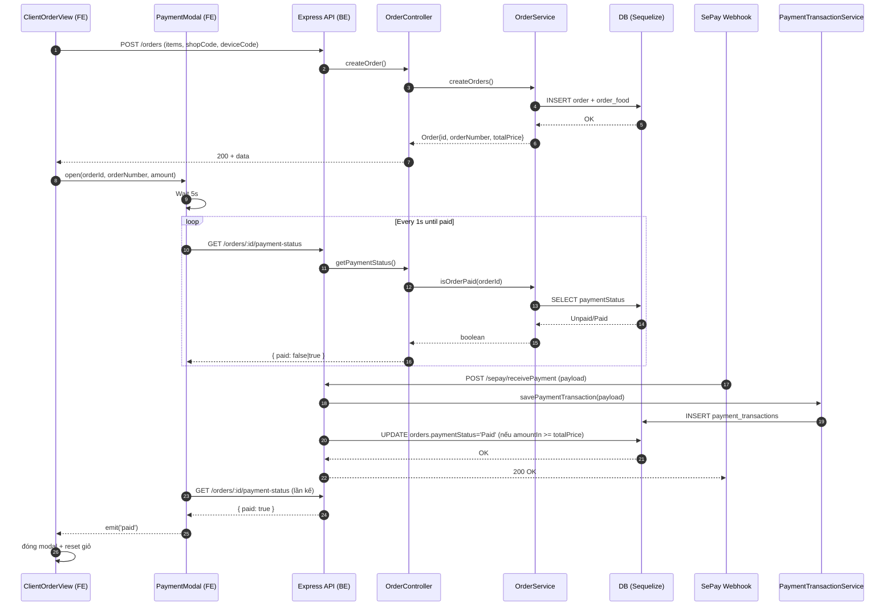
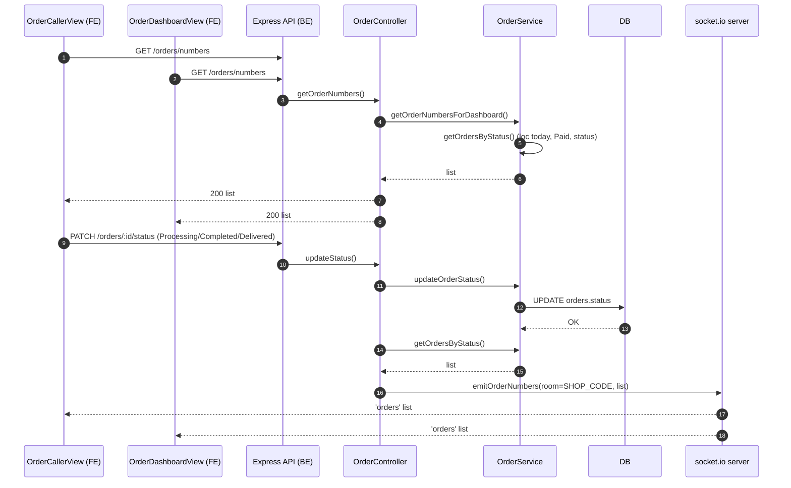
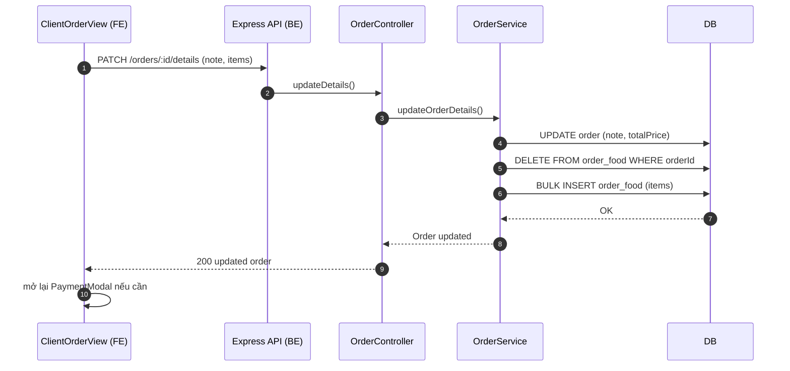

# ClientOrderSystem Flows

## 1) Create Order + Payment QR + Polling + SePay Webhook

```mermaid
sequenceDiagram
    autonumber
    participant Client as ClientOrderView (FE)
    participant Modal as PaymentModal (FE)
    participant API as Express API (BE)
    participant OC as OrderController
    participant OS as OrderService
    participant DB as DB (Sequelize)
    participant SePay as SePay Webhook
    participant PTS as PaymentTransactionService

    Client->>API: POST /orders (items, shopCode, deviceCode)
    API->>OC: createOrder()
    OC->>OS: createOrders()
    OS->>DB: INSERT order + order_food
    DB-->>OS: OK
    OS-->>OC: Order{id, orderNumber, totalPrice}
    OC-->>Client: 200 + data

    Client->>Modal: open(orderId, orderNumber, amount)
    Modal->>Modal: Wait 5s
    loop Every 1s until paid
        Modal->>API: GET /orders/:id/payment-status
        API->>OC: getPaymentStatus()
        OC->>OS: isOrderPaid(orderId)
        OS->>DB: SELECT paymentStatus
        DB-->>OS: Unpaid/Paid
        OS-->>OC: boolean
        OC-->>Modal: { paid: false|true }
    end

    SePay->>API: POST /sepay/receivePayment (payload)
    API->>PTS: savePaymentTransaction(payload)
    PTS->>DB: INSERT payment_transactions
    API->>DB: UPDATE orders.paymentStatus='Paid' (nếu amountIn >= totalPrice)
    DB-->>API: OK
    API-->>SePay: 200 OK

    Modal->>API: GET /orders/:id/payment-status (lần kế)
    API-->>Modal: { paid: true }
    Modal-->>Client: emit('paid')
    Client->>Client: đóng modal + reset giỏ
```

## 2) Caller/Dashboard: Load + Realtime + Change Status

```mermaid
sequenceDiagram
    autonumber
    participant Caller as OrderCallerView (FE)
    participant Dash as OrderDashboardView (FE)
    participant API as Express API (BE)
    participant OC as OrderController
    participant OS as OrderService
    participant DB as DB
    participant Socket as socket.io server

    Caller->>API: GET /orders/numbers
    Dash->>API: GET /orders/numbers
    API->>OC: getOrderNumbers()
    OC->>OS: getOrderNumbersForDashboard()
    OS->>OS: getOrdersByStatus() (lọc today, Paid, status)
    OS-->>OC: list
    OC-->>Caller: 200 list
    OC-->>Dash: 200 list

    Caller->>API: PATCH /orders/:id/status (Processing/Completed/Delivered)
    API->>OC: updateStatus()
    OC->>OS: updateOrderStatus()
    OS->>DB: UPDATE orders.status
    DB-->>OS: OK
    OC->>OS: getOrdersByStatus()
    OS-->>OC: list
    OC->>Socket: emitOrderNumbers(room=SHOP_CODE, list)
    Socket-->>Caller: 'orders' list
    Socket-->>Dash: 'orders' list
```

## 3) Update Order Details

```mermaid
sequenceDiagram
    autonumber
    participant Client as ClientOrderView (FE)
    participant API as Express API (BE)
    participant OC as OrderController
    participant OS as OrderService
    participant DB as DB

    Client->>API: PATCH /orders/:id/details (note, items)
    API->>OC: updateDetails()
    OC->>OS: updateOrderDetails()
    OS->>DB: UPDATE order (note, totalPrice)
    OS->>DB: DELETE FROM order_food WHERE orderId
    OS->>DB: BULK INSERT order_food (items)
    DB-->>OS: OK
    OS-->>OC: Order updated
    OC-->>Client: 200 updated order
    Client->>Client: mở lại PaymentModal nếu cần
```
